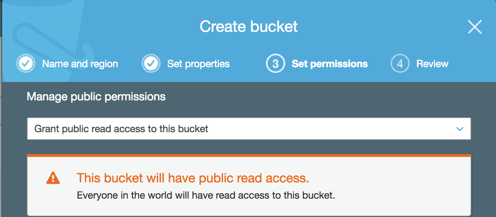
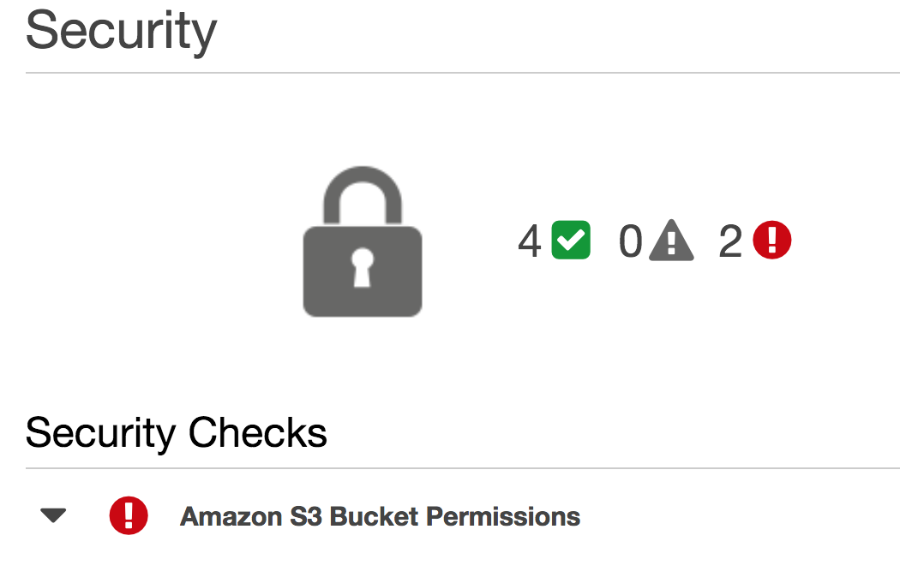
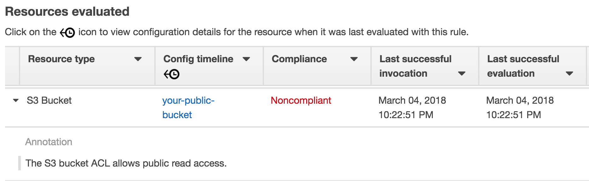

# Preventing Data Breaches From Your S3 Buckets

There have been a number of high-profile customer or corporate data breaches in the last year. Several of them have been attributed to mis-configured AWS S3 buckets, c.f. the [FedEx breach](http://www.zdnet.com/article/unsecured-server-exposes-fedex-customer-records/), the [Verizon breach](https://www.infosecurity-magazine.com/news/verizon-hit-by-another-amazon-s3/), or the [Experian breach](https://www.scmagazine.com/open-aws-s3-bucket-exposes-sensitive-experian-and-census-info-on-123-million-us-households/article/720067/). In this article I'll show you how to detect public S3 buckets in your AWS account so you can prevent an embarassing and costly data breach.

## S3 is Secure By Default

AWS S3 buckets not public unless you make them public. If you choose to make your S3 bucket public, Amazon makes this clear when you create your bucket:

If you are browsing your list of S3 buckets, Amazon adds a "public" tag to any publicly available S3 bucket so you can tell at a glance if it's public.

## Trusted Advisor Check

If you have too many buckets to scan in the S3 console, you can use AWS Trusted Advisor to see a security dashboard of public S3 buckets. [AWS Trusted Advisor](https://aws.amazon.com/premiumsupport/faqs/#Trusted_Advisor) is not as well known as it should be. It provides many best-practice checks with recommendations on improving security, fault-tolerance, cost optimization, and performance. Although the full list of Trusted Advisor checks is only available if you have [premium support](https://aws.amazon.com/premiumsupport/trustedadvisor/), AWS [recently made the S3 Public Bucket check free](https://aws.amazon.com/about-aws/whats-new/2018/02/aws-trusted-advisors-s3-bucket-permissions-check-is-now-free/).

Here's an example of the Trusted Advisor S3 bucket check.

I recommend you run Trusted Advisor in your AWS accounts as soon as possible. You'll definitely find things to improve upon in your account and you may even find an open S3 bucket that shouldn't be open. You can even set up a weekly notification email with up-to-date Trusted Advisor recommendations, or configure [CloudWatch to trigger a Slack notification](https://docs.aws.amazon.com/awssupport/latest/user/cloudwatch-events-ta.html).

## AWS Config Rules for S3 Buckets

AWS Config continuously monitors and records changes to AWS resources, like EC2 instances, S3 buckets, etc. AWS Config evaluates your AWS resources against built-in or custom Rules to mark resources as "non-compliant" or automatically remediate mis-configured S3 buckets, or other AWS resources.

AWS provides two built-in [AWS Config](https://aws.amazon.com/config/) Rules for [monitoring and reporting on publicly accessible S3 buckets](https://aws.amazon.com/blogs/mt/example-scenarios-for-aws-config-continuous-monitoring-of-amazon-s3-bucket-access-controls/).

You can set up these rules to automatically notify you if anyone creates a publicly-accessible S3 bucket, and mark these buckets as "non-compliant" in the AWS Config dashboard.

Here's an example of the AWS S3 Config rule dashboard showing a "non-compliant" S3 bucket.

## Summary

Amazon S3 is an incredibly useful and foundational service in AWS. Although S3 buckets have always been secure by default, in light of recent major data breaches, AWS has made it easier to see which S3 buckets have been set to "public" read or write access. In this article, I showed you three ways to check which (if any) of your S3 buckets are public: via the S3 console, a free Trusted Advisor check, and via AWS Config rules.

You can use one or all of these together to ensure you never have an embarassing and costly data breach.

If you have additional questions about S3 (or anything AWS-related), email me at doug@1strategy.com. I’d be happy to chat with you about how 1Strategy can help your business with your journey into or through the AWS cloud.

